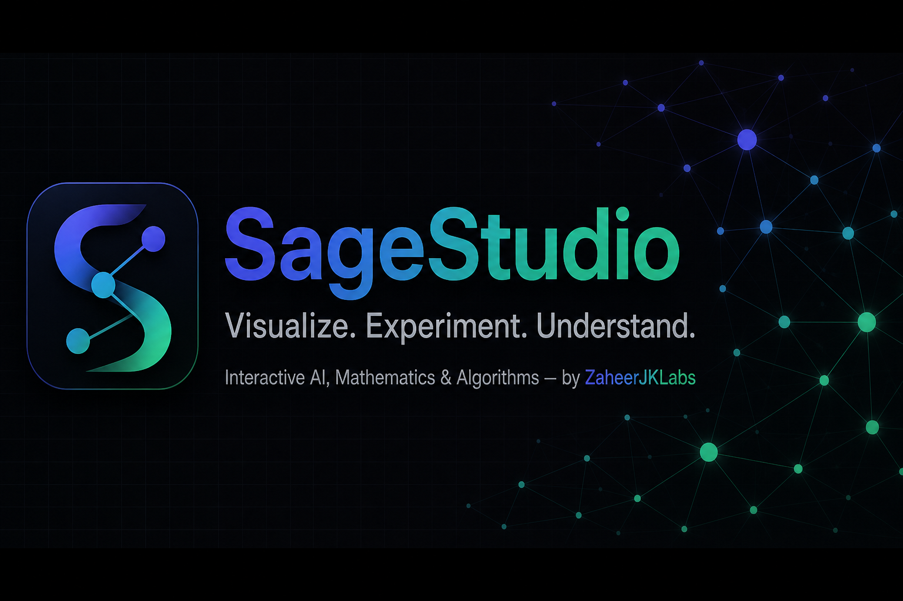

<div align="center">


# SageStudio

### **Visualize. Experiment. Understand.**

*Where AI, Mathematics, and Algorithms Come Alive.*

<br/>

[](https://github.com/zaheerjklabs/SageStudio/releases)
[](https://nextjs.org/)
[](https://react.dev/)
[](https://www.typescriptlang.org/)
[](./LICENSE)

[](https://tailwindcss.com/)
[](https://www.framer.com/motion/)
[](https://katex.org/)
[](https://zustand.docs.pmnd.rs/)
[]()

<br/>

**[Explore](#-featured-visualizations) &nbsp;·&nbsp; [Install](#-installation) &nbsp;·&nbsp; [Architecture](#-architecture) &nbsp;·&nbsp; [Tech Stack](#-tech-stack) &nbsp;·&nbsp; [License](#-license)**

<br/>



</div>

---

## 🧠 About

**SageStudio** is an interactive visualization laboratory for **Mathematics**, **Statistics**, **Machine Learning**, **Deep Learning**, **Neural Networks**, and **Optimization** — built by [**ZaheerJKLabs**](https://github.com/zaheerjklabs).

> **Don't just read how an algorithm works — see it work.**

Change parameters with sliders, inputs, and toggles. Watch algorithms learn, cluster, optimize, and propagate in **real time**. Every control drives a **real computation** — not a fake animation.

SageStudio is inspired by the educational interactivity of TensorFlow Playground, Distill-style explanations, and interactive mathematical tools — with its own original design, branding, and implementation.

---

## ✨ Features

| | Feature | Description |
|---|---|---|
| 🎛️ | **Fully Interactive** | Sliders, toggles, and controls that immediately update visualizations |
| 🧮 | **Real Algorithms** | Linear regression, K-Means, gradient descent, neural networks — implemented in TypeScript |
| 📐 | **LaTeX Math** | Beautiful KaTeX-rendered formulas with step-by-step explanations |
| 🧠 | **Neural Network Playground** | Build networks, choose activations, train on XOR/spiral/circle datasets |
| 🌙 | **Dark-First Design** | Premium dark UI with light mode — Linear × Vercel × scientific lab aesthetic |
| 🔍 | **Global Search** | Find any algorithm or concept instantly (`⌘K`) |
| ⭐ | **Favorites & History** | Save favorites and track recently viewed labs (localStorage) |
| 📱 | **Responsive** | Desktop, tablet, and mobile — controls reflow below visualizations |
| ♿ | **Accessible** | Keyboard navigation, ARIA labels, reduced-motion support |
| 🚀 | **No Backend** | 100% client-side — no API keys, no Python server required |

---

## 🔬 Featured Visualizations

| Visualization | Category | Description |
|---|---|---|
| [**Function Visualizer**](./src/visualizations/mathematics/FunctionVisualizerViz.tsx) | Mathematics | Plot functions, tangents, and derivatives |
| [**Gradient Descent**](./src/visualizations/optimization/GradientDescentViz.tsx) | Optimization | GD, SGD, Momentum, RMSProp, Adam on loss landscapes |
| [**Linear Regression**](./src/visualizations/machine-learning/LinearRegressionViz.tsx) | ML | Watch a regression line learn with animated residuals |
| [**K-Means**](./src/visualizations/machine-learning/KMeansViz.tsx) | ML | Step-by-step clustering with centroid animation |
| [**Decision Tree**](./src/visualizations/machine-learning/DecisionTreeViz.tsx) | ML | Interactive tree with Gini impurity & entropy |
| [**Neural Network Playground**](./src/visualizations/neural-networks/NeuralNetworkPlaygroundViz.tsx) | Neural Networks | Build, train, and visualize networks |
| [**Activation Functions**](./src/visualizations/deep-learning/ActivationFunctionsViz.tsx) | Deep Learning | ReLU, Sigmoid, Tanh, GELU and derivatives |
| [**CNN Visualizer**](./src/visualizations/deep-learning/CNNVisualizerViz.tsx) | Deep Learning | Convolution, ReLU, pooling pipeline |
| [**LSTM Cell**](./src/visualizations/deep-learning/LSTMVisualizerViz.tsx) | Deep Learning | Gates, cell state, hidden state |
| [**Transformer Attention**](./src/visualizations/deep-learning/TransformerAttentionViz.tsx) | Deep Learning | Self-attention heatmap with multi-head attention |

Open any lab at: **`/simulations/<slug>`** — e.g. `/simulations/neural-network-playground`

---

## 🚀 Installation

**Requirements:** Node.js 18+ · npm · Windows / macOS / Linux

```bash
# Clone the repository
git clone https://github.com/zaheerjklabs/SageStudio.git
cd SageStudio

# Install dependencies
npm install

# Start development server
npm run dev
```

Open **[http://localhost:3000](http://localhost:3000)** in your browser.

### Production Build

```bash
npm run build
npm start
```

---

## 🏗 Architecture

SageStudio follows a clean separation of concerns:

```
Input → Algorithm Engine → Model State → Visualization → Explanation
```

```
src/
├── algorithms/              # Real math & ML implementations
│   ├── regression/          # Linear regression engine
│   ├── clustering/          # K-Means engine
│   ├── optimization/        # Gradient descent optimizers
│   ├── neural-networks/     # Forward/backprop, activations
│   ├── classification/      # Decision trees
│   └── mathematics/         # Function evaluation & derivatives
│
├── visualizations/          # Interactive lab components
│   ├── mathematics/
│   ├── machine-learning/
│   ├── deep-learning/
│   ├── neural-networks/
│   └── optimization/
│
├── components/
│   ├── ui/                  # Button, Card, Formula
│   ├── controls/            # Slider, inputs
│   ├── layout/              # Navbar, Footer, Search
│   └── visualization/       # LabLayout framework
│
├── data/algorithms.ts       # Algorithm registry & search
└── store/                   # Theme & favorites (Zustand)
```

Every visualization uses the shared **`LabLayout`** — consistent controls, metrics, explanations, and step-by-step learning mode.

---

## 🛠 Tech Stack

| Layer | Technology |
|---|---|
| **Framework** | [Next.js 15](https://nextjs.org/) (App Router) |
| **UI** | [React 19](https://react.dev/) + [TypeScript](https://www.typescriptlang.org/) (strict) |
| **Styling** | [Tailwind CSS v4](https://tailwindcss.com/) |
| **Animation** | [Framer Motion](https://www.framer.com/motion/) |
| **Math** | [KaTeX](https://katex.org/) via react-katex |
| **Visualization** | Canvas, SVG, [D3.js](https://d3js.org/) |
| **State** | [Zustand](https://zustand.docs.pmnd.rs/) |
| **Icons** | [Lucide React](https://lucide.dev/) |

---

## 🎯 How It Works

```
  Choose a concept  →  Change parameters  →  Watch it happen  →  Understand the math
```

1. **Pick** an algorithm from Explore or Search
2. **Adjust** learning rate, K, neurons, activation functions…
3. **Run** training and watch real-time updates
4. **Learn** with LaTeX formulas and plain-language explanations
5. **Share** via `/simulations/<slug>` URLs

---

## 🗺 Roadmap

- [ ] Logistic Regression, SVM, PCA, KNN
- [ ] URL parameter encoding for shareable experiments
- [ ] Experiment mode (side-by-side comparison)
- [ ] Web Workers for heavy neural network training
- [ ] User accounts & saved experiments
- [ ] Additional statistics & probability visualizations

---

## 🤝 Contributing

Contributions are welcome! Whether it's a new visualization, algorithm engine, bug fix, or documentation improvement:

1. Fork the repository
2. Create a feature branch (`git checkout -b feature/amazing-viz`)
3. Commit your changes (`git commit -m 'Add amazing visualization'`)
4. Push to the branch (`git push origin feature/amazing-viz`)
5. Open a Pull Request

Please follow the existing architecture: **Algorithm Engine → Model State → Visualization**.

---

## 📄 License

This project is licensed under the **MIT License** — see the [LICENSE](./LICENSE) file for details.

---

<div align="center">

<br/>

**SageStudio**

*Visualize. Experiment. Understand.*

**Interactive Mathematics, Machine Learning & Deep Learning**

by [**ZaheerJKLabs**](https://github.com/zaheerjklabs)

<br/>

[](https://github.com/zaheerjklabs/SageStudio)

</div>
